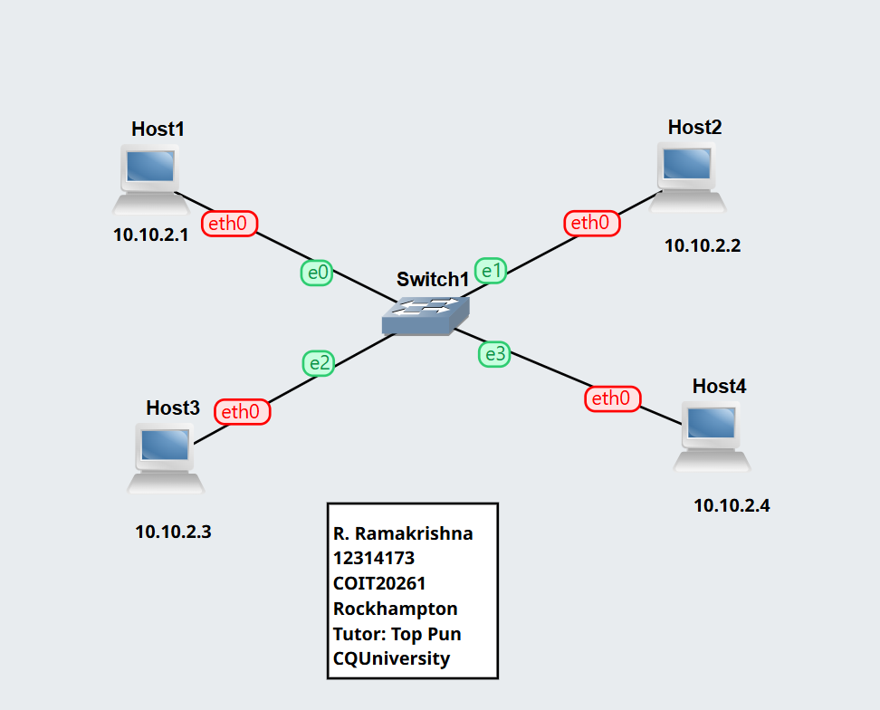
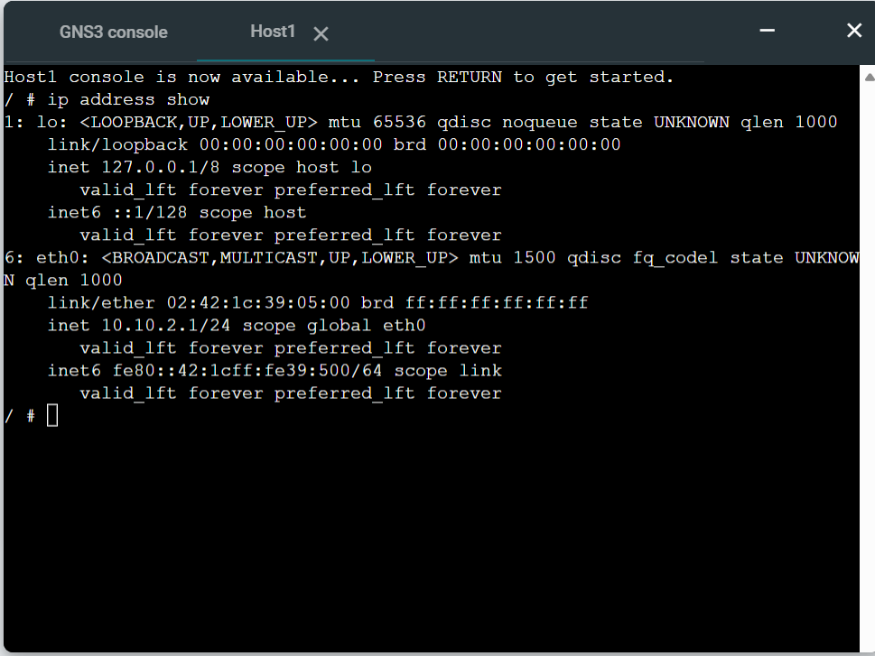
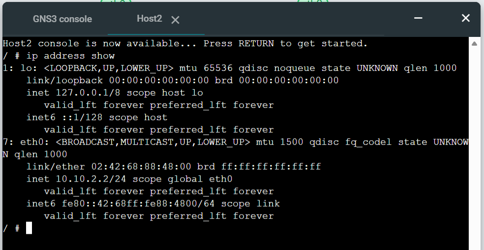
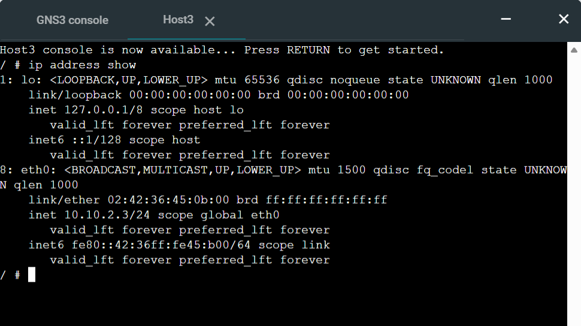
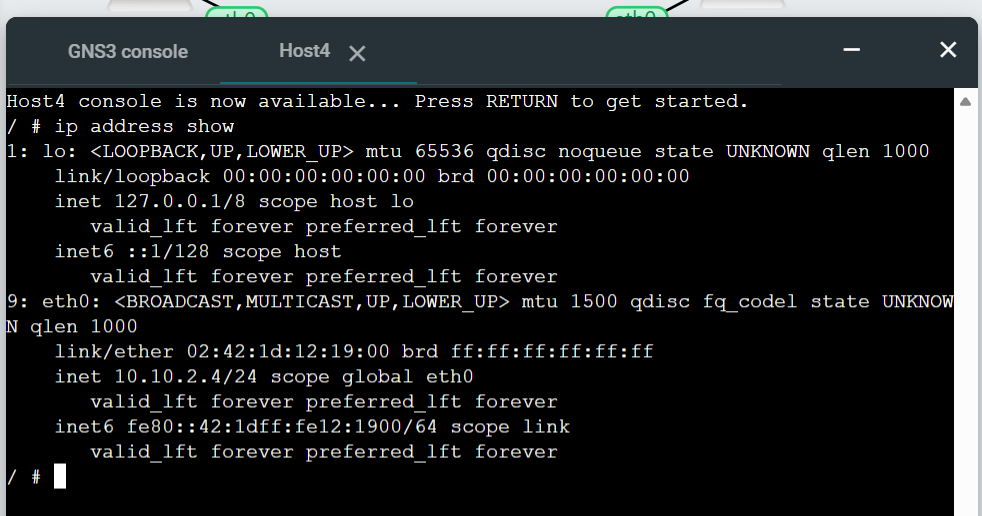
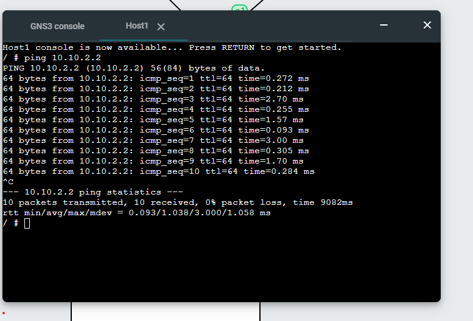
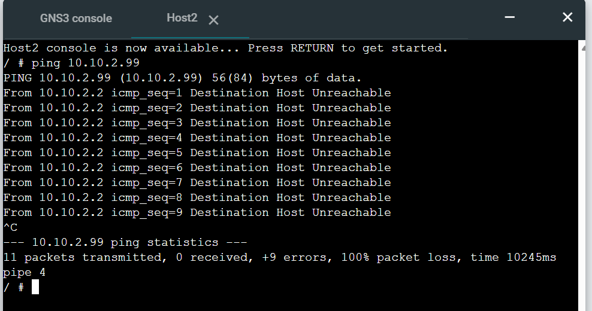
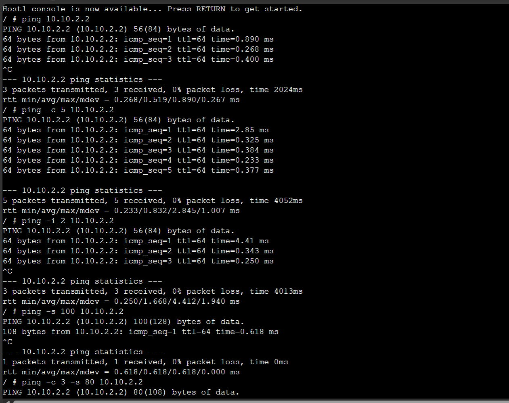

# Week02 – IP Configuration and Network Testing

## Overview

In this week, the focus was on configuring static IP addresses using different methods and testing network connectivity using the ping command. The activities helped in understanding both persistent and temporary IP configuration techniques as well as basic network troubleshooting.

-----

## Task 1: Setting Static IP Addresses

### Activities Performed
- Created a GNS3 project named: Setting-IP-12314173
- Added four Linux hosts and one Ethernet switch
- Connected all hosts to form a LAN
- Setting network for them 

### IP Configuration Methods

#### 1. Using GNS3 Configure Menu
- Assigned static IP addresses to two hosts before starting them
- Configuration applied automatically when nodes were started

#### 2. Using `/etc/network/interfaces`
- Opened console of third host
- Edited the file to manually assign IP address
- Restarted network service using:
commands are:
  
```bash
  
nano /etc/network/interfaces
ifdown eth0
ifup eth0

```
  
#### 3. Using `ip` Command
- Configured IP address on fourth host using:
Command used:

```bash

ip address add <ipaddress>/<mask> dev eth0

```
 
For my Host 4 IP address using

```bash

ip address add 10.10.2.4/24 dev eth0
```

## Testing Results (IP Verification)

Command used:

```bash
ip address show
```
### Observations
- All four hosts successfully received unique IP addresses
- Interfaces were active and correctly configured

----

## Screenshots
#### Screenshot 1: Network Topology
- This screenshot shows the GNS3 network topology with four hosts connected through a switch, each assigned with a unique IP address in the same subnet.
 


 #### Screenshot 2: Host1 IP
 - This screenshot shows the console output of Host1 displaying its assigned IP address using the `ip address show` command.



#### Screenshot 3: Host2 IP
- This screenshot shows the console output of Host2 confirming its IP address configuration.



 #### Screenshot 4: Host3 IP
- This screenshot shows the console output of Host3 where the IP address was configured using the `/etc/network/interfaces` file.



#### Screenshot 5: Host4 IP
- This screenshot shows the console output of Host4 where the IP address was assigned using the `ip` command.
- 


----

## Reflection (Task 1)
This task improved my understanding of different methods to assign IP addresses in Linux systems. I learned the difference between permanent configuration using system files and temporary configuration using command-line tools.

---
## Task 2: Testing Network Connectivity using Ping

### Activities Performed
- Tested connectivity between hosts using ping command
- Ran ping without options and observed output
- Tested ping to an invalid IP address
- Used different options such as count, interval, and packet size
---

## Ping Testing 

### 1. Basic Ping
```
ping 10.10.2.2
```
- Successful communication between hosts
- Observed round-trip time 
---

### 2. Ping to Invalid Address
```
ping 10.10.2.99
```
- No response received
- 100% packet loss observed
---

### 3. Ping with Options

- Limited number of packets sent
- Modified packet size and interval
- Observed variation in delay

Limit the count of request messages to 5:

```
ping -c 5 10.10.2.2
```
Change the interval between request messages to 2 seconds:

```
ping -i 2 10.10.2.2
```
Change the size of the data sent in a request message to 100 Bytes:

```
ping -s 100 10.10.2.2
```

You can combine options, e.g.:
```
ping -c 3 -s 80 10.10.2.2
```
---

## 📸 Screenshots

#### Screenshot 6: Simple Ping  
- This screenshot shows a successful ping test between two hosts, confirming network connectivity within the same subnet.
  


#### Screenshot 7: Ping to Invalid Address
 -> This screenshot shows the result of pinging an invalid IP address, resulting in "Destination Host Unreachable" and 100% packet loss.
 


#### Screenshot 8: Ping with Options
-> This screenshot demonstrates the use of ping command with options such as count, interval, and packet size to analyse network performance.



---

## Reflection (Task 2)
This task helped me understand how to verify connectivity and measure network performance using ping. I learned how different options affect the behavior of the command and how packet loss indicates connectivity issues.

---
## Key Concepts Learned

- Static IP configuration methods
- Persistent vs temporary network settings
- Use of ping for connectivity testing
- Packet loss and its meaning

## Key Knowledge

- Understanding how to assign static IP addresses using multiple methods in Linux systems
- Difference between persistent configuration (/etc/network/interfaces) and temporary configuration (ip command)
- Basic structure and purpose of the /etc/network/interfaces file
- Importance of restarting network services after modifying configuration files
- Using "ip address show" to verify IP address assignment
- Understanding how IP addressing enables communication within a network
- Use of the ping command to test connectivity between hosts
- Identifying network issues using ping errors like "Destination Host Unreachable"
