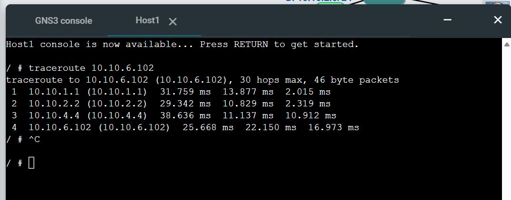
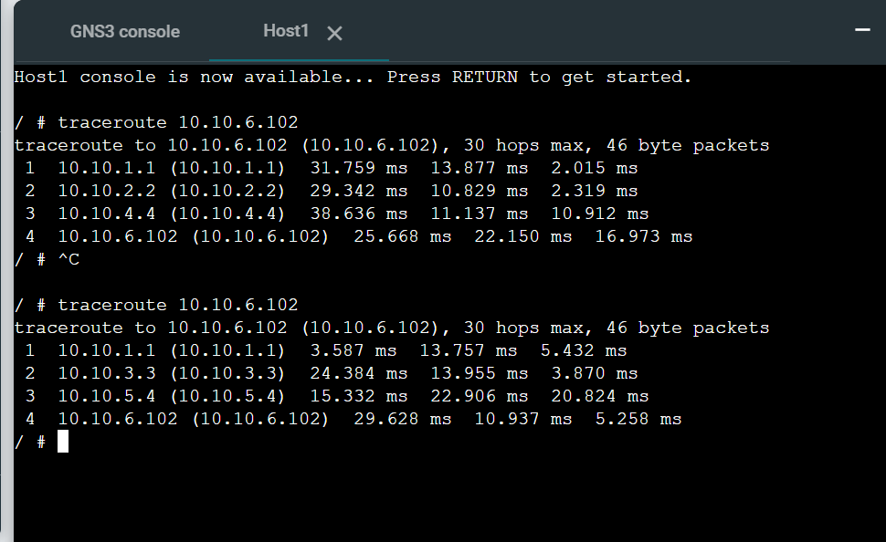

# week04 – Routing Tables and OSPF

## Overview
This week focused on understanding how routing works in networks. The first task involved configuring a router and hosts across two subnets and analysing routing tables. The second task explored dynamic routing using OSPF, where routers automatically exchange routing information and adapt to network changes.

---

# Task 1: View Routing Tables

## Aim
To understand how routing tables work and how a router forwards packets between different subnets.

---
## Activities Performed
- Created project: View-Routes-12314173
- Added:
  - 3 Linux Hosts
  - 1 Linux Router
  - 1 Ethernet Switch
- Designed network with two subnets:
  - Subnet 1: 10.10.1.0/24
  - Subnet 2: 10.10.2.0/24
- Configured static IP addresses for all devices
- Set gateway (router IP) for hosts
- Enabled IP forwarding on router
- Disabled IP forwarding on hosts
- Started all nodes and verified routing tables
- Tested connectivity using ping

---

## Configuration Details

| **Step** | **Task** | **Description** | **Status** |
|---|---|---|---|
| 1 | Create New Project | Created project named `View-Routes-12314173` in GNS3 | Done |
| 2 | Add Network Devices | Added three Linux hosts, one Linux router, and one Ethernet switch | Done |
| 3 | Connect Network | Connected all devices to form two subnets using a switch and router | Done |
| 4 | Design Subnets | Configured two subnets: `10.10.1.0/24` and `10.10.2.0/24` | Done |
| 5 | Configure Host1 | Assigned static IP address and gateway using `/etc/network/interfaces` | Done |
| 6 | Configure Host2 | Assigned static IP address and gateway using `/etc/network/interfaces` | Done |
| 7 | Configure Host3 | Assigned static IP address and gateway in second subnet | Done |
| 8 | Configure Router Interfaces | Assigned IP addresses to router interfaces for both subnets | Done |
| 9 | Enable IP Forwarding (Router) | Enabled packet forwarding using `sysctl net.ipv4.ip_forward=1` | Done |
| 10 | Disable IP Forwarding (Hosts) | Ensured hosts do not forward packets (`ip_forward=0`) | Done |
| 11 | Start All Nodes | Started all devices in GNS3 | Done |
| 12 | Verify Routing Tables | Used `ip route show` to view routing tables on hosts and router | Done |
| 13 | Test Connectivity | Used `ping` to verify communication between subnets | Done |
| 14 | Record Outputs | Captured screenshots of network, routing tables, and ping results | Done |

###  Host 1 Configuration

```bash
auto eth0
iface eth0 inet static
   address 10.10.1.11
   netmask 255.255.255.0
   gateway 10.10.1.1
   up sysctl net.ipv4.ip_forward=0
```
### Host 2 Configuration

```bash
auto eth0
iface eth0 inet static
	address 10.10.1.12
	netmask 255.255.255.0
	gateway 10.10.1.1
        up sysctl net.ipv4.ip_forward=0
```
### Host 3 Configuration

```bash
auto eth0
iface eth0 inet static
	address 10.10.2.2
	netmask 255.255.255.0
	gateway 10.10.2.1
        up sysctl net.ipv4.ip_forward=0
```

### Router Configuration

```bash
auto eth0
iface eth0 inet static
   address 10.10.1.1
   netmask 255.255.255.0

auto eth1
iface eth1 inet static
   address 10.10.2.1
   netmask 255.255.255.0
   up sysctl net.ipv4.ip_forward=1
```
### Routing Table Command

```bash
ip route show
```
### Observations

-Hosts used router as default gateway
-Router had routes for both subnets
-Communication between subnets was successful

---

## Week 04 – Project Files

> You can find my Week 04 GNS3 project file using the link below.
> This includes the IP configuration setup and related work completed for this lab.
>
> [View-Routes Files](./)

## Screenshots

#### Screenshot Network Topology

This screenshot shows the network with three hosts and one router forming two subnets.


#### Screenshot Routing Table Output

This screenshot shows routing tables of hosts and router.


#### Screenshot Ping Test

This screenshot shows successful communication between hosts across different subnets.


---
## Reflection (Task 1)

This task helped me understand how routers enable communication between different networks. I learned the importance of routing tables and how default gateways are used to forward packets. It also improved my understanding of IP forwarding and network segmentation.

----

# Task 2: Dynamic Routing with OSPF

-To observe how dynamic routing works and how OSPF adapts to changes in the network.

#### Activities Performed
-project as OSPF-Basics-12314173
-Started all nodes and waited for routers to boot
-Accessed router console using vtysh
-Executed OSPF commands to observe routing information
-Observed path change using traceroute

#### OSPF Commands Used
```
show ip ospf neighbor
show ip ospf route
show ip route
```
## Week 04 – Project Files

> You can find my Week 04 GNS3 project file using the link below.
> This includes the IP configuration setup and related work completed for this lab.
>
> [OSPF Project File](./images/OSPF-Basics-12314173.gns3project)

## Results

### OSPF Network Screenshot


### OSPF Neighbours

-Routers successfully discovered neighbouring routers and formed adjacency relationships. All neighbours reached the FULL state, indicating proper OSPF communication.


### Routing Tables

-Routes were dynamically learned
-Multiple paths available for some destinations

### Routing Table (Router 1 - FRR1)

-Routing table shows directly connected networks and dynamically learned routes.


### Routing Table (Router 2 - FRR2 / FRR3)

-Second router also shows dynamically learned routes through OSPF.


### Routing Summary Table

### FRR1

| Destination | Next Node |
|------------|-----------|
| 10.10.1.0/24 | Directly connected |
| 10.10.2.0/24 | Directly connected |
| 10.10.3.0/24 | Directly connected |
| 10.10.4.0/24 | via 10.10.2.2 |
| 10.10.5.0/24 | via 10.10.3.3 |
| 10.10.6.0/24 | via 10.10.2.2 / via 10.10.3.3 |

### FRR2

| Destination | Next Node |
|------------|-----------|
| 10.10.2.0/24 | Directly connected |
| 10.10.4.0/24 | Directly connected |
| 10.10.1.0/24 | via 10.10.2.1 |
| 10.10.3.0/24 | via 10.10.2.1 |
| 10.10.5.0/24 | via 10.10.4.4 |
| 10.10.6.0/24 | via 10.10.4.4 |

### FRR3

| Destination | Next Node |
|------------|-----------|
| 10.10.3.0/24 | Directly connected |
| 10.10.5.0/24 | Directly connected |
| 10.10.1.0/24 | via 10.10.3.1 |
| 10.10.2.0/24 | via 10.10.3.1 |
| 10.10.4.0/24 | via 10.10.5.4 |
| 10.10.6.0/24 | via 10.10.5.4 |

### FRR4

| Destination | Next Node |
|------------|-----------|
| 10.10.4.0/24 | Directly connected |
| 10.10.5.0/24 | Directly connected |
| 10.10.6.0/24 | Directly connected |
| 10.10.2.0/24 | via 10.10.4.2 |
| 10.10.3.0/24 | via 10.10.5.3 |
| 10.10.1.0/24 | via 10.10.4.2 / via 10.10.5.3 |

## 6. Traceroute Before and After Link Failure

### Before Link Failure

-Traceroute was performed from Host1 to Host2 (10.10.6.102) while all links were active.

```bash
traceroute 10.10.6.102
```


### After Link Failure (NETem node stopped)

-After stopping the NETem node, the original path was broken. OSPF automatically recalculated the route and selected an alternative path

```bash
traceroute 10.10.6.102
```


### Reflection (Task 2)

-Learned how to configure and enable OSPF for dynamic routing between routers.
-Understood how routers automatically exchange routing information using OSPF.
-Gained experience in troubleshooting issues like OSPF not running and zebra errors.
-Observed how OSPF provides automatic failover when a network link is disconnected.
-Improved skills in verifying network behaviour using commands like traceroute and routing table checks.

----
### Concepts Learned

Static Network Configuration
-Understood how to configure IP addresses, gateways, and enable IP forwarding for inter-network communication.

Difference Between Static and Dynamic Routing
-Gained knowledge of how static routing requires manual setup, while OSPF dynamically updates routes.

OSPF Neighbour Formation and Route Learning
-Learned how routers form OSPF adjacencies and automatically exchange routing information.

----

### Key Knowledge

-Understanding how routing tables store destination networks and next-hop information for packet forwarding.
-Knowledge of configuring static IP addressing, gateways, and enabling/disabling IP forwarding.
-Concept of dynamic routing using OSPF, where routers automatically exchange route information.
-Awareness of OSPF neighbour relationships and route propagation across multiple routers.
-Understanding of network resilience, where OSPF provides alternate paths and ensures connectivity during link failures.


