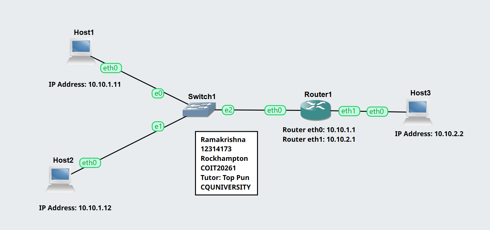
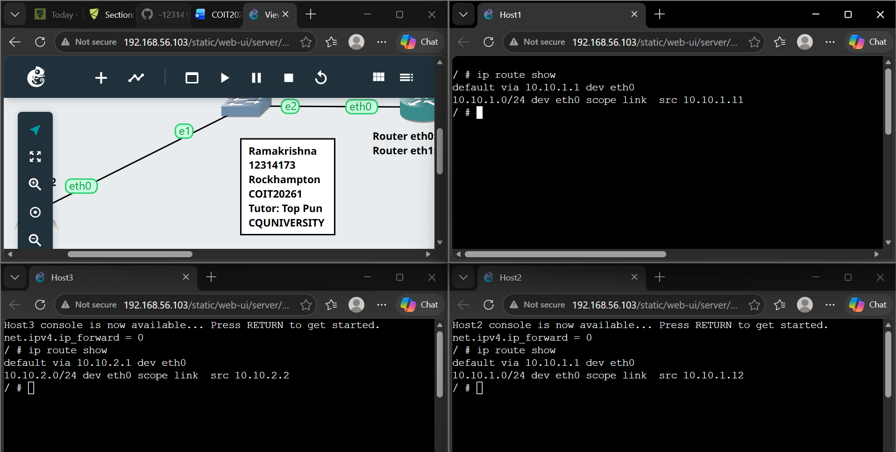
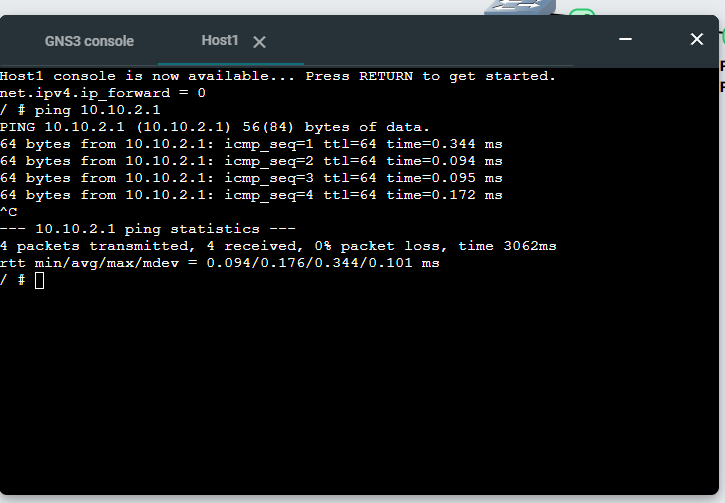
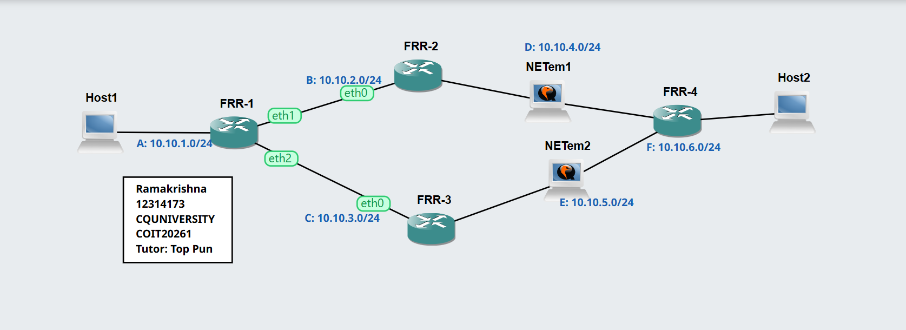
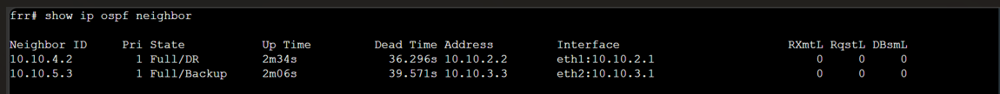
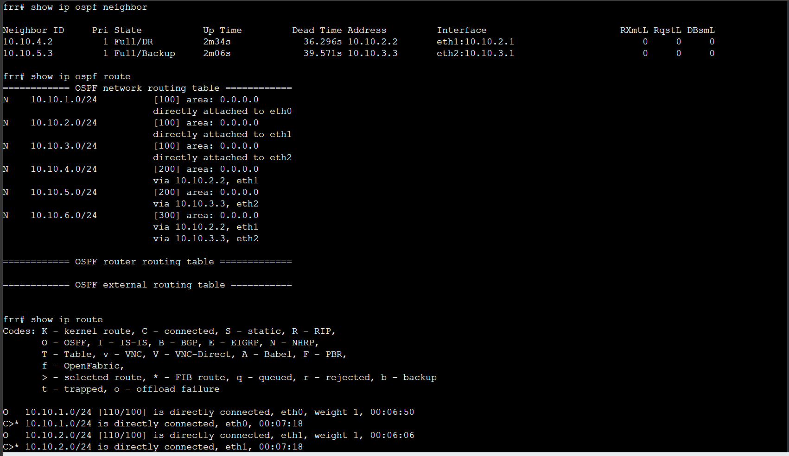
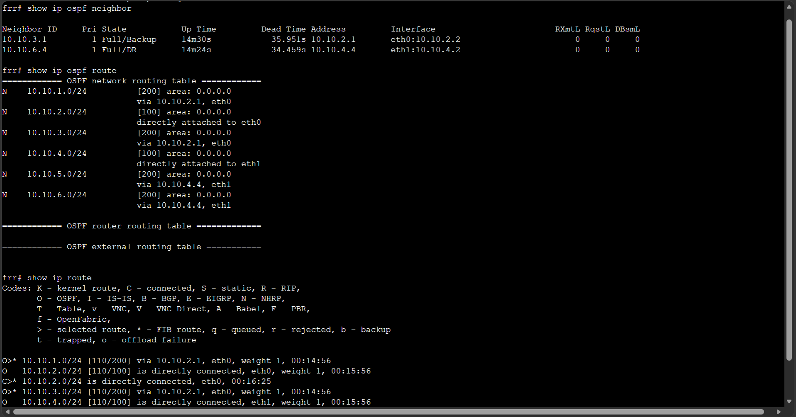

# Week04 – Routing Tables and OSPF

## Overview
This week focused on understanding how routing works in networks. The first task involved configuring a router and hosts across two subnets and analysing routing tables. The second task explored dynamic routing using OSPF, where routers automatically exchange routing information and adapt to network changes.

---

# Task 1: View Routing Tables

## Aim
To understand how routing tables work and how a router forwards packets between different subnets.

---
## Activities Performed
- Created project: View-Routes-12314173
- Added:
  - 3 Linux Hosts
  - 1 Linux Router
  - 1 Ethernet Switch
- Designed network with two subnets:
  - Subnet 1: 10.10.1.0/24
  - Subnet 2: 10.10.2.0/24
- Configured static IP addresses for all devices
- Set gateway (router IP) for hosts
- Enabled IP forwarding on router
- Disabled IP forwarding on hosts
- Started all nodes and verified routing tables
- Tested connectivity using ping

---

## Configuration Details

###  Host 1 Configuration

```bash
auto eth0
iface eth0 inet static
   address 10.10.1.11
   netmask 255.255.255.0
   gateway 10.10.1.1
   up sysctl net.ipv4.ip_forward=0
```
### Host 2 Configuration

```bash
auto eth0
iface eth0 inet static
	address 10.10.1.12
	netmask 255.255.255.0
	gateway 10.10.1.1
        up sysctl net.ipv4.ip_forward=0
```
### Host 3 Configuration

```bash
auto eth0
iface eth0 inet static
	address 10.10.2.2
	netmask 255.255.255.0
	gateway 10.10.2.1
        up sysctl net.ipv4.ip_forward=0
```

### Router Configuration

```bash
auto eth0
iface eth0 inet static
   address 10.10.1.1
   netmask 255.255.255.0

auto eth1
iface eth1 inet static
   address 10.10.2.1
   netmask 255.255.255.0
   up sysctl net.ipv4.ip_forward=1
```
### Routing Table Command

```bash
ip route show
```
### Observations
-Hosts used router as default gateway
-Router had routes for both subnets
-Communication between subnets was successful
---
## Screenshots

#### Screenshot Network Topology

This screenshot shows the network with three hosts and one router forming two subnets.



#### Screenshot Routing Table Output

This screenshot shows routing tables of hosts and router.



#### Screenshot Ping Test

This screenshot shows successful communication between hosts across different subnets.



---
## Reflection (Task 1)

This task helped me understand how routers enable communication between different networks. I learned the importance of routing tables and how default gateways are used to forward packets. It also improved my understanding of IP forwarding and network segmentation.

----

# Task 2: Dynamic Routing with OSPF

-To observe how dynamic routing works and how OSPF adapts to changes in the network.

#### Activities Performed
-project as OSPF-Basics-12314173
-Started all nodes and waited for routers to boot
-Accessed router console using vtysh
-Executed OSPF commands to observe routing information
-Observed path change using traceroute

#### OSPF Commands Used
```
show ip ospf neighbor
show ip ospf route
show ip route
```
## Results

### OSPF Network Screenshot



### OSPF Neighbours

-Routers successfully discovered neighbouring routers and formed adjacency relationships. All neighbours reached the FULL state, indicating proper OSPF communication.



### Routing Tables

-Routes were dynamically learned
-Multiple paths available for some destinations

### Routing Table (Router 1 - FRR1)

-Routing table shows directly connected networks and dynamically learned routes.



### Routing Table (Router 2 - FRR2 / FRR3)

-Second router also shows dynamically learned routes through OSPF.



### Routing Summary Table

<<<<<<<<<<<<<<<<screenshothere>>>>>>>>>>>>>>>

## 6. Traceroute Before and After Link Failure

### Before Link Failure

-Traceroute was performed from Host1 to Host2 (10.10.6.102) while all links were active.

```bash
traceroute 10.10.6.102
```
[Traceroute Before](./images/OSPF-12314173-traceroute-before.png)

### After Link Failure (NETem node stopped)

-After stopping the NETem node, the original path was broken. OSPF automatically recalculated the route and selected an alternative path

```bash
traceroute 10.10.6.102
```
[Traceroute After](./images/OSPF-12314173-traceroute-after.png)


