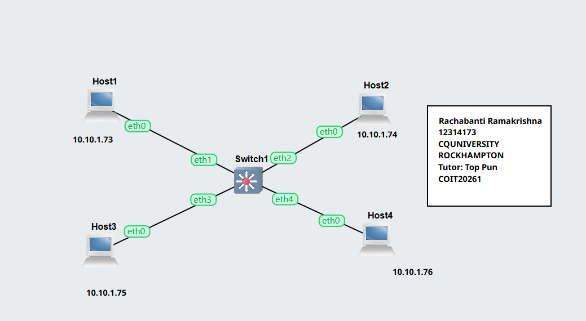
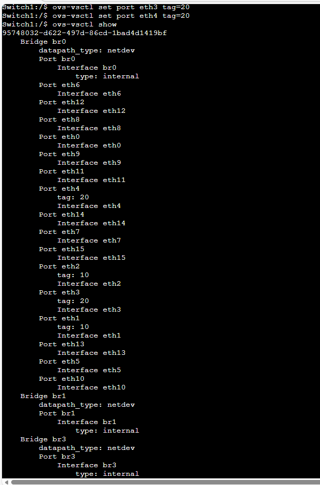
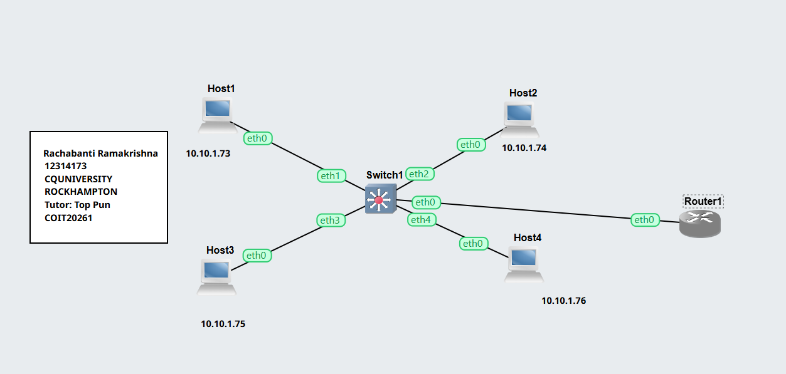
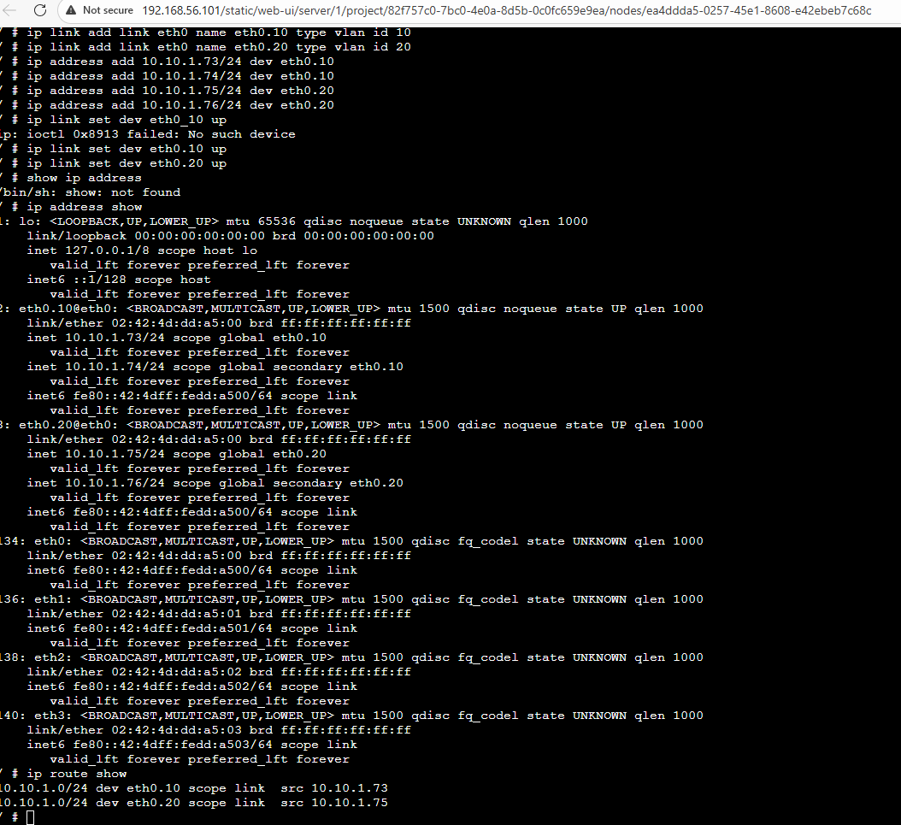
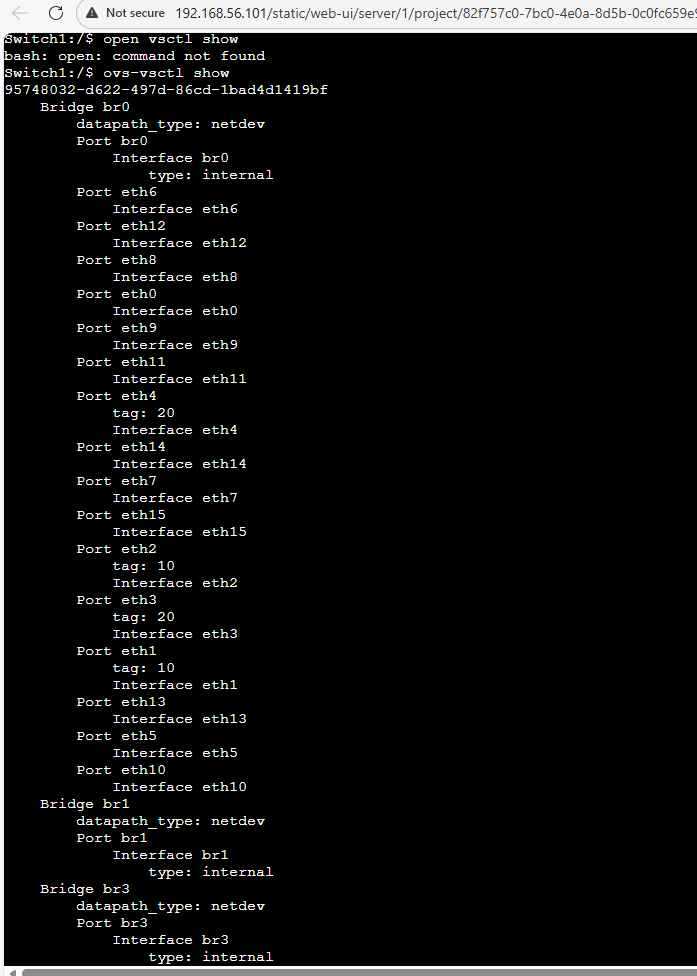

# week05 – VLAN Configuration on Switch and Router

## Overview
In this week, I explored how Virtual LANs (VLANs) are configured on a switch and how a router can be used to enable communication between different VLANs. The tasks focused on segmenting a network and then restoring connectivity using routing techniques.

---
## Task 1: VLAN Configuration on Switch

### Objective
To divide a network into separate VLANs using a managed switch and observe how VLANs restrict communication.

###  Network Setup
- 4 Linux Hosts connected to an OpenvSwitch
- Hosts connected to ports: eth1 to eth4
- All hosts initially assigned IP addresses in the same subnet

## Host Configuration

| **Step** | **Task** | **Description** | **Status** |
|---|---|---|---|
| 1 | Create VLAN Project | Created project `Vlan-Basics-12314173` in GNS3 | Done |
| 2 | Add Network Devices | Added four Linux hosts and one OpenvSwitch | Done |
| 3 | Connect Hosts | Connected all hosts to switch ports `eth1` to `eth4` | Done |
| 4 | Assign IP Addresses | Configured all hosts with IP addresses in same subnet | Done |
| 5 | Start Nodes | Started all hosts and switch in GNS3 | Done |
| 6 | Test Initial Connectivity | Verified all hosts can communicate before VLAN configuration | Done |
| 7 | Configure VLANs (Access Ports) | Assigned VLAN 10 to `eth1`, `eth2` and VLAN 20 to `eth3`, `eth4` | Done |
| 8 | Verify VLAN Configuration | Used `ovs-vsctl show` to check port tags | Done |
| 9 | Test VLAN Isolation | Verified communication fails between different VLANs | Done |
| 10 | Create Router Project | Created project `Vlan-Router-12314173` for inter-VLAN routing | Done |
| 11 | Add Router | Added Linux router and connected to switch via `eth0` | Done |
| 12 | Configure VLAN Sub-Interfaces | Created `eth0.10` and `eth0.20` interfaces on router | Done |
| 13 | Assign VLAN IP Addresses | Assigned IP addresses to VLAN sub-interfaces on router | Done |
| 14 | Enable Interfaces | Activated router VLAN interfaces using `ip link set` | Done |
| 15 | Configure Trunk Port | Configured switch port `eth0` as trunk for VLAN 10 and 20 | Done |
| 16 | Verify Routing | Checked routing using `ip address show` and `ip route show` | Done |
| 17 | Test Inter-VLAN Connectivity | Verified hosts in different VLANs can communicate via router | Done |
| 18 | Record Outputs | Captured required screenshots for network and VLAN configuration | Done |

## Week 05 – VLAN Configuration on Switch

> You can find the project files for both tasks completed in this week below. These files include VLAN setup on the switch   and the inter-VLAN routing configuration.
>
> [Vlan Switch Project File](./images/Vlan-Basics-12314173.gns3project)

----

###  Network Topology



IP Address are:
```
- Host1 → 10.10.1.73  
- Host2 → 10.10.1.74  
- Host3 → 10.10.1.75  
- Host4 → 10.10.1.76  
```
All hosts are connected to a single switch.

### VLAN 
The switch ports were divided into two VLANs:
```
- VLAN 10 → Host1, Host2 (eth1, eth2)
- VLAN 20 → Host3, Host4 (eth3, eth4)
```
### VLAN Ports Configuration



Commands used:
```bash
ovs-vsctl set port eth1 tag=10
ovs-vsctl set port eth2 tag=10
ovs-vsctl set port eth3 tag=20
ovs-vsctl set port eth4 tag=20
```
For Verification

Command used:
```baash
ovs-vsctl show
```
#### Testing 

Communication within same VLAN was successful
Communication between VLAN 10 and VLAN 20 failed
This confirms VLAN isolation

## Reflection (Task 1)

This task demonstrated how VLANs can logically divide a network even when all devices are connected to the same switch. It clearly showed that VLANs prevent communication across groups unless routing is introduced.

-----

## Task 2: Inter-VLAN Routing

### Objective
To enable communication between VLANs using a router.

### Network setup

-Hosts were divided into two different subnets based on VLAN assignment.

### Router Configuration

Created VLAN sub-interfaces:
```bash
ip link add link eth0 name eth0.10 type vlan id 10
ip link add link eth0 name eth0.20 type vlan id 20
```
#### Assigned Gateway IP:
```
ip address add 10.10.1.73/24 dev eth0.10
ip address add 10.10.1.74/24 dev eth0.10

ip address add 10.10.1.75/24 dev eth0.20
ip address add 10.10.1.76/24 dev eth0.20
```
Enabled interfaces:
```
ip link set eth0.10 up
ip link set eth0.20 up
```
## Week 05 – VLAN Router Project File

> You can find the project files for both tasks completed in this week below. These files include VLAN setup on the switch > and the inter-VLAN routing configuration.
>
> [VLAN Router Project File](./images/Vlan-Router-12314173.gns3project)

### Network Topology Screenshot



#### For Verification
```
ip address show
ip route show
```
#### Switch Trunk Configuration
 ```
ovs-vsctl set port eth0 trunks=10,20
```
### Vlan-Router Ports


### Vlan-Router Tags 



### Testing 

Hosts from different VLANs were able to communicate
Router successfully forwarded traffic between VLANs
Verified using routing table and IP configuration

## Reflection (Task 2)

This task helped me understand how routers are used to connect multiple VLANs. I learned how VLAN tagging works and how a single physical interface can support multiple VLANs using sub-interfaces.

-----

### Key Concepts Learned

VLAN segmentation isolates network traffic
Access ports belong to a single VLAN
Trunk ports carry multiple VLANs
VLAN tagging enables logical separation
Router-on-a-stick enables inter-VLAN routing

### Key Knowledge

VLAN IDs are used to identify network segments
Switch configuration controls VLAN membership
Routers are required for VLAN communication
Sub-interfaces allow multiple VLANs on one interface
Proper IP addressing ensures correct routing


