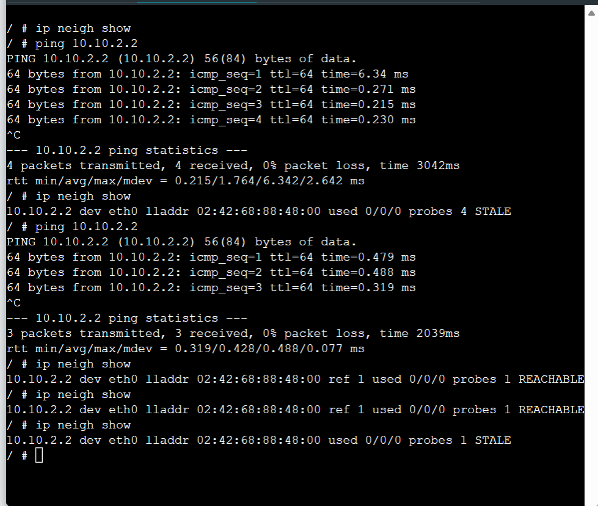
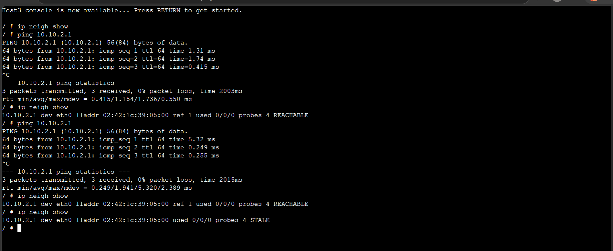
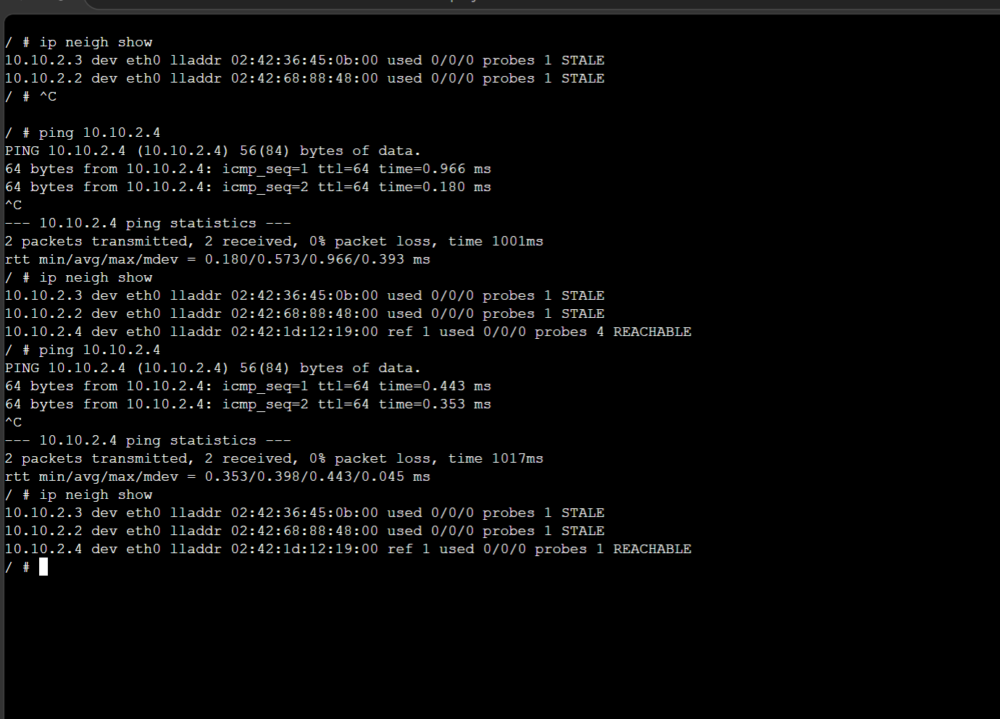
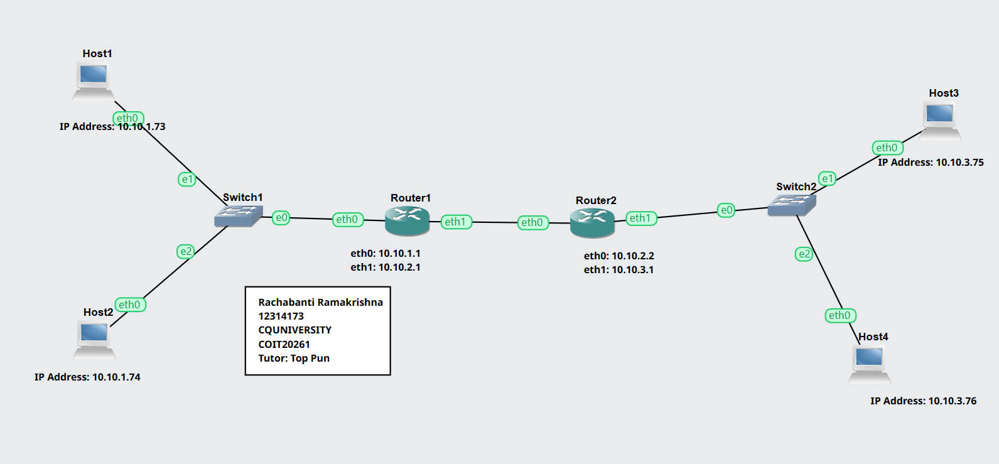
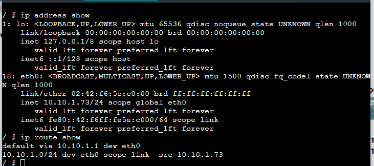
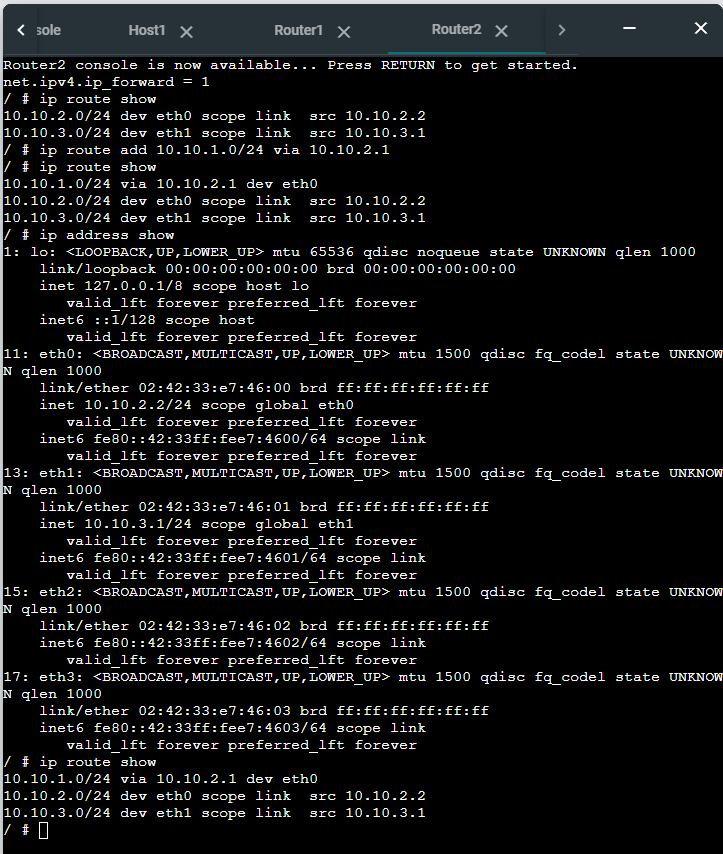
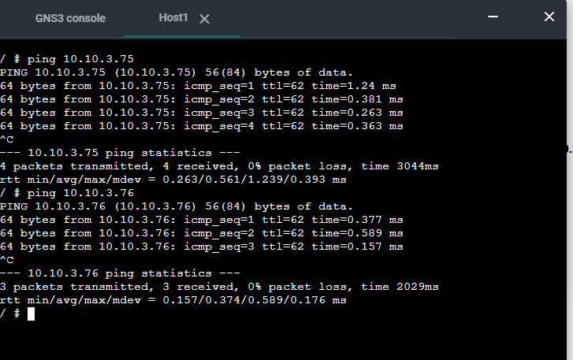

# week06 – ARP and Default Gateway Configuration

## Overview

This week focused on understanding how devices resolve IP addresses to hardware addresses using ARP, and how default gateways enable communication between different networks. The tasks demonstrated both local network communication and routing between multiple subnets.


## Task 1: Resolving IP Addresses using ARP

### Objective
To observe how ARP maps IP addresses to MAC addresses and how entries are updated during communication.


### Network Setup
- Used existing project `Setting-IP-12314173`
- 4 Linux Hosts connected via a switch
- All hosts configured with IP addresses in same subnet
  
### Commands Used

```bash
ip neigh show
ping <destination-ip>
```

### Activities Performed

Viewed ARP table on Host A before communication
Pinged Host B from Host A
Viewed ARP table again and observed new entry
Pinged Host A from Host C
Observed ARP table changes again

## Week 06 – ARP Configuration

> You can find the project files and outputs for both ARP analysis and default gateway configuration below. These include    ARP table observations, ping results, and routing setup across multiple subnets.

> [ARP Configuration Project File](./images/ARP-Basics-12314173.gns3project)
> 
→ Shows how IP addresses are resolved to MAC addresses using ARP and how the ARP table updates during communication.

## Screenshots







---

###  Reflection (Task 1)

-This task helped me understand how ARP works in resolving IP addresses to MAC addresses within a local network. I observed how entries are dynamically created when communication occurs and how ARP maintains updated mappings.

-------

## Task 2: Default Gateway Configuration

### Objective
To configure default gateways and enable communication between multiple subnets.

### Network Setup
- Created project `Default-Gateway-12314173`
- 4 Linux Hosts, 2 Routers, and 2 Switches
- Designed 3 subnets:
  - Subnet 1: Hosts A & B
  - Subnet 2: Hosts C & D
  - Subnet 3: Router-to-router connection

### Configuration

- Assigned IP addresses to all hosts and routers  
- Configured default gateways on hosts  
- Enabled IP forwarding on routers  
- Disabled IP forwarding on hosts  

## Week 06 – Default Gateway Configuration

> You can find the project files and outputs for default gateway configuration below. 

> [Default Gateway Project File](./images/Default-Gateway-12314173.gns3project)

→ Demonstrates routing between different networks using default gateways and successful communication across subnets.

### Screenshots

**Network Topology**  


**Routing Tables**  




**Ping Test**  


### Reflection (Task 2)

This task helped me understand how default gateways allow communication between different subnets. I learned how routers forward packets and how proper gateway configuration ensures connectivity across networks.

### Key Knowledge & Skills Developed

Developed a clear understanding of how ARP (Address Resolution Protocol) maps IP addresses to MAC (hardware) addresses within a local network.
Learned how to use the ip neigh show command to view and analyse ARP tables.
Observed how ARP table entries change dynamically between states such as REACHABLE and STALE during communication.
Gained practical experience in testing connectivity using the ping command and interpreting results.
Understood the role of a default gateway in enabling communication between different subnets.
Configured static IP addresses and default gateways using the /etc/network/interfaces file.
Learned the importance of enabling IP forwarding on routers and disabling it on hosts for correct network behaviour.
Developed troubleshooting skills by verifying routing tables and ensuring successful communication across networks.
