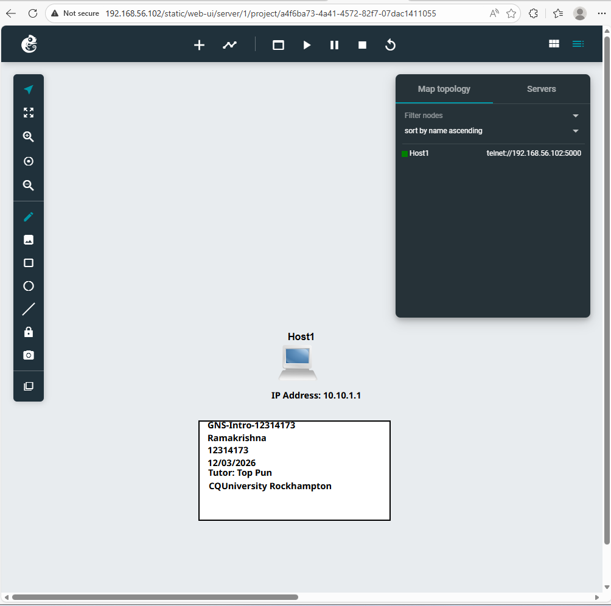
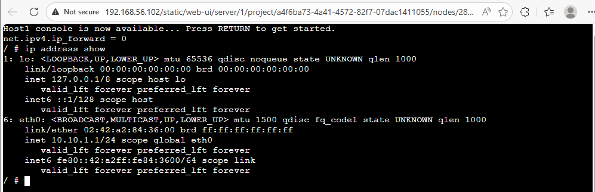

## Task 1: Introduction to GNS3 Basics
## Lab Overview
This lab introduces the GNS3 network simulator. The objective was to create a simple network project with a single Linux host and understand how network simulation environments work. GNS3 allows users to design, configure, and test network topologies without using physical hardware.

##Host Configuration

| **Step** | **Task** | **Description** | **Status** |
|---|---|---|---|
| 1 | Create New Project | Created project named `GNS3-Intro-<studentid>` in GNS3 |  Done |
| 2 | Add Linux Host | Dragged a single Linux Host node onto the workspace |  Done |
| 3 | Add Project Info Text | Added text showing project title, name, student ID, date, unit code, campus, and teacher |  Done |
| 4 | Select IP Address | Selected static IP address `10.10.1.1` for the host |  Done |
| 5 | Add IP Label | Added text near the node displaying the IP address `10.10.1.1` |  Done |
| 6 | Configure Static IP | Edited `/etc/network/interfaces` to set static IP before starting the node |  Done |
| 7 | Start the Node | Started the Linux host node in GNS3 |  Done |
| 8 | Open Web Console | Opened a web console in a new browser tab |  Done |
| 9 | Verify IP Address | Ran `ip address show` to confirm the IP address configuration | Done|
| 10 | Close Project | Verified all outputs, documented commands and learnings, then closed the project | Done|

---

##  Network Interface Configuration

### File: `/etc/network/interfaces`

The following configuration was applied to the `/etc/network/interfaces` file **before** starting the node:

```bash
# Static config for eth0
auto eth0
iface eth0 inet static
    address 10.10.1.1
    netmask 255.255.255.0
    up sysctl net.ipv4.ip_forward=0
```

### Configuration Explained

| **Line** | **Command** | **Purpose** |
|---|---|---|
| 1 | `auto eth0` | Automatically brings up the eth0 interface at boot |
| 2 | `iface eth0 inet static` | Specifies that the eth0 interface uses a static IPv4 configuration. |
| 3 | `address 10.10.1.1` | Assigns the IP address 10.10.1.1 to the eth0 network interface. |
| 4 | `netmask 255.255.255.0` | Defines the subnet mask for the network, indicating the network range. |
| 5 | `up sysctl net.ipv4.ip_forward=0` | Disables IP forwarding so the system does not route packets between networks. |

### Purpose of disabling IP Forwarding?
IP forwarding is disabled to ensure that the Linux node operates only as a host device and does not forward packets between network interfaces. This prevents the system from acting as a router in the network topology.

---

##  Commands Used

| S.N. | Command | **Purpose** |
|---|---|---|
| 1 | `ip address show` | Displays the current IP address and network interface configuration of the system. |
| 2 | `cat /etc/network/interfaces` | Shows the contents of the network configuration file. |
| 3 | `sysctl net.ipv4.ip_forward` | Displays whether IP forwarding is enabled or disabled in the system. |


### Example Output: `ip address show`


```
1: lo: <LOOPBACK,UP,LOWER_UP> mtu 65536 qdisc noqueue state UNKNOWN qlen 1000
    link/loopback 00:00:00:00:00:00 brd 00:00:00:00:00:00
    inet 127.0.0.1/8 scope host lo
       valid_lft forever preferred_lft forever
    inet6 ::1/128 scope host
       valid_lft forever preferred_lft forever

3: eth0: <BROADCAST,MULTICAST,UP,LOWER_UP> mtu 1500 qdisc fq_codel state UNKNOWN qlen 1000
    link/ether 02:42:b9:24:73:00 brd ff:ff:ff:ff:ff:ff
    inet 10.10.1.1/24 scope global eth0
       valid_lft forever preferred_lft forever
    inet6 fe80::42:b9ff:fe24:7300/64 scope link
       valid_lft forever preferred_lft forever
```

### Output Explained

| **Field** | **Value** | **Meaning** |
|---|---|---|
| Interface | eth0 | Ethernet interface |
| State | UP, LOWER_UP | |
| MTU | 1500 | Maximum Transmission Unit (standard Ethernet) |
| MAC Address | 02:42:b9:24:73:00 |  |
| IPv4 Address | 10.10.1.1/24 | Static IP address with /24 subnet |
| IPv6 Address | fe80::42:b9ff:fe24:7300/64 |  |

---

## Screenshots 

### Screenshot 1: GNS3 Network Topology

> This screenshot shows the GNS3 workspace with the Linux host node, project title, student details, and IP address label.



---

### Screenshot 2: Console Output — IP Address Verification

> This screenshot shows the web console output of the `ip address show` command, confirming the static IP address `10.10.1.1` is correctly assigned to eth0.



---

##  Key Knowledge & Skills Developed

### Networking Concepts

| **S.N.** | **Concept** | **Learning Outcomes** |
|---|---|---|
| 1 | Static IP Configuration | How to manually assign an IP address to a Linux network interface using `/etc/network/interfaces` |
| 2 | Subnet Mask | Understanding how a subnet mask defines the network and host portions of an IP address. |
| 3 | IP Forwarding | Understanding how IP forwarding allows a system to route packets between networks and how to enable or disable it. |
| 4 | Network Interfaces |  Understanding how network interfaces (like `eth0`) allow a system to connect and communicate within a network. |


### Technical Skills

| **S.N.** | **Skill** | **Description** |
|---|---|---|
| 1 | GNS3 Project Setup | Creating new projects, ... |
| 2 | Linux CLI | Using commands like `ip address show`,.. |
| 3 | File Editing | Editing the `/etc/network/interfaces` configuration file to ... |
| 4 | Network Verification | Confirming IP settings by reading and interpreting `ip address show` output |
| 5 | Documentation | Documenting configuration steps, commands, and outputs clearly in the GitHub README file. |


---


##  Reflection

### Key Success or Positive Outcomes?

- Successfully configured a static IP address on a Linux host within GNS3
- Gained practical experience using the GNS3 network simulator  
- Learned how to configure network interfaces using the `/etc/network/interfaces` file
- Verified network configuration using Linux CLI commands such as `ip address show`
- Improved understanding of basic networking concepts such as subnet masks and IP forwarding

### Challenges faced and how you solved it?

- The configuration changes did not appear immediately. Restarting the node in GNS3 helped apply the network configuration successfully.
- I initially found it difficult to understand the output of the `ip address show` command. After reviewing the interface details, I was able to identify the IP address, MAC address, and interface status.
- At first, I was not sure where to edit the network configuration file. I solved this by checking the correct path `/etc/network/interfaces` and editing it in the Linux node.


---
